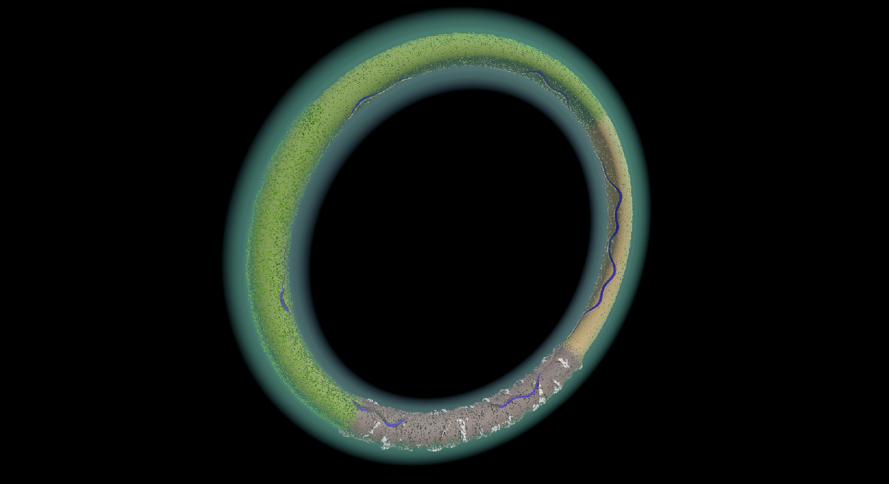
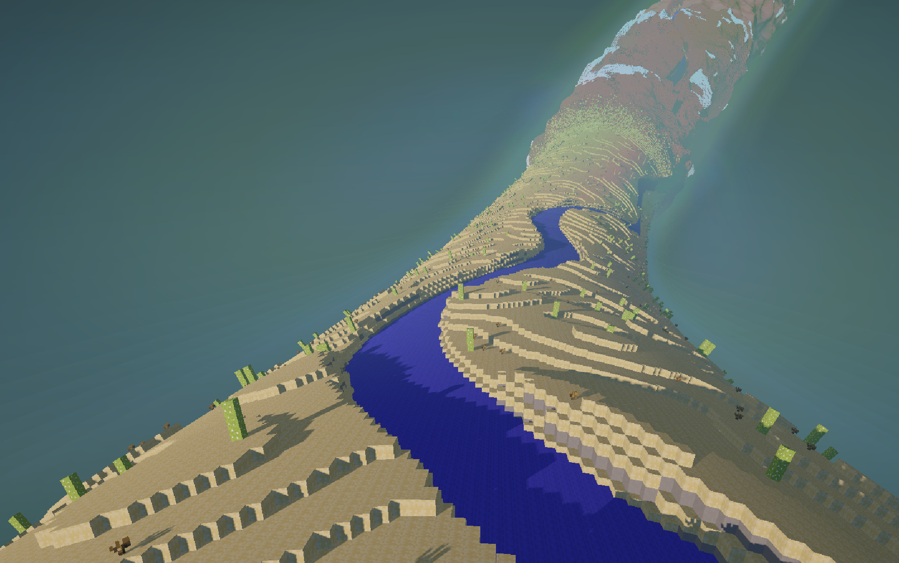
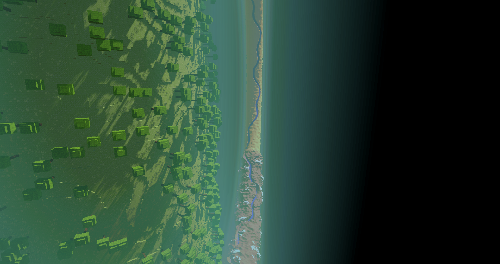

# TorusWorld

A Unity project for a block-based world set on a torus-shaped planet.

## Features

 - Procedural terrain generation
 - Simple Biome System
 - Structure (tree) placement
 - Texture atlas
 - Atmosphere (somewhat faked)
 - Distant chunks render at lower resolutions to improve performance
 - Collision detection
 - Block breaking and placing
 - Player movement